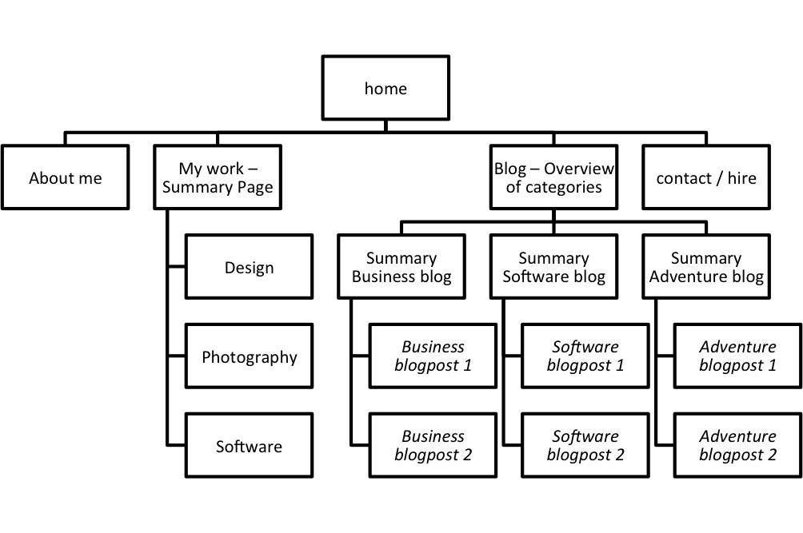

##What are the 6 Phases of Web Design?##
Web Design has __six__ distinct phases

1. _Information Gathering_: During the information gathering phase, you try to obtain as much relevant information as possibe about the purpose of the site, the goals you wnat to achieve with it (ie. make money, amuse people with cat pics or be informative), who the target audience will consist of and what kind of content you will provide

2. _Planning_: In the planning phase, you structure the site by making a list of all topics or subtopics and by structuring them in logical navigation blocks. You can represent this work with a sitemap

3. _Design_: Make a skin (graphical look and feel) of the site. Try to keep your target audience in mind when choosing colors, fonts etc.

4. _Development_: This is when you will write the actual code

5. _Testing & Delivery_: In this phase you will thoroughly test your code compared to the initial plan. It's a good practice to test the different links and try to render the pages in different browsers.

6. _Maintenance_: In the maintenance phase, you will incorporate technological changes that may be required (ie. new dimensions for facebook pictures) or fix bugs that may have surfaced past the delivery phase.

##What is your site's primary goal or purpose? What kind of content will your site feature?##
My site's main purpose is to give a complete image of myself, both as an individual as well as a professional. I want to take advantage of website's flexibility (compared to a static resume) to provide a more complete and nuanced reflection of myself. As the sitemap illustrates, I will do this by creating:
* a regular one pager about myself
* showcasing previous work in a portfolio
* writing blogposts about my three passions: Business, Technology and Adventure

##What is your target audience's interests and how do you see your site addressing them?##
My target audience consists of 2 groups:
* _People interested in my writing or adventures_: 

##What is the primary "action" the user should take when coming to your site? Do you want them to search for information, contact you, or see your portfolio? It's ok to have several actions at once, or different actions for different kinds of visitors.##

##What are the main things someone should know about design and user experience?##

##What is user experience design and why is it valuable?##

##Which parts of the challenge did you find tedious?##