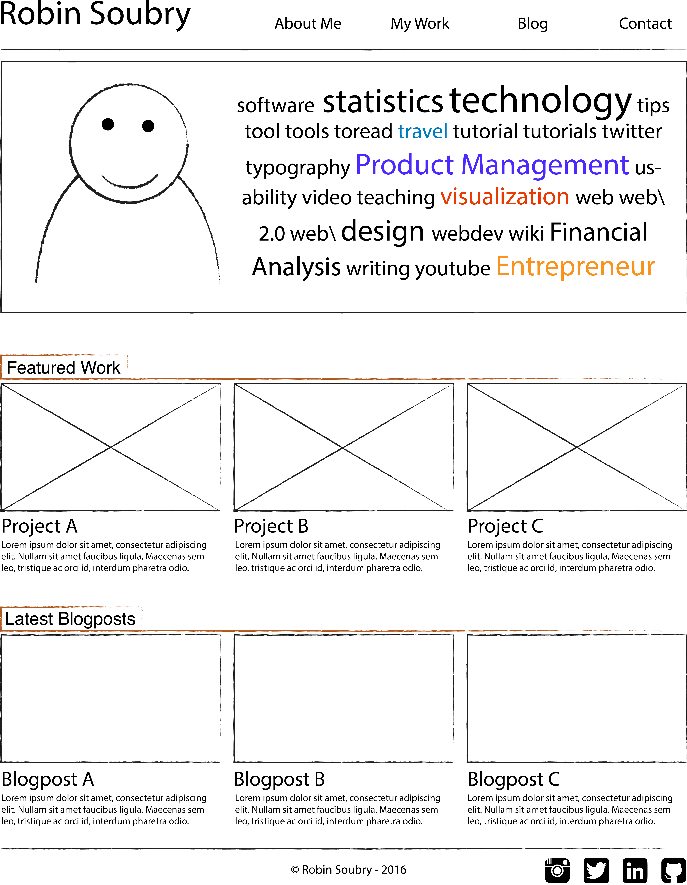
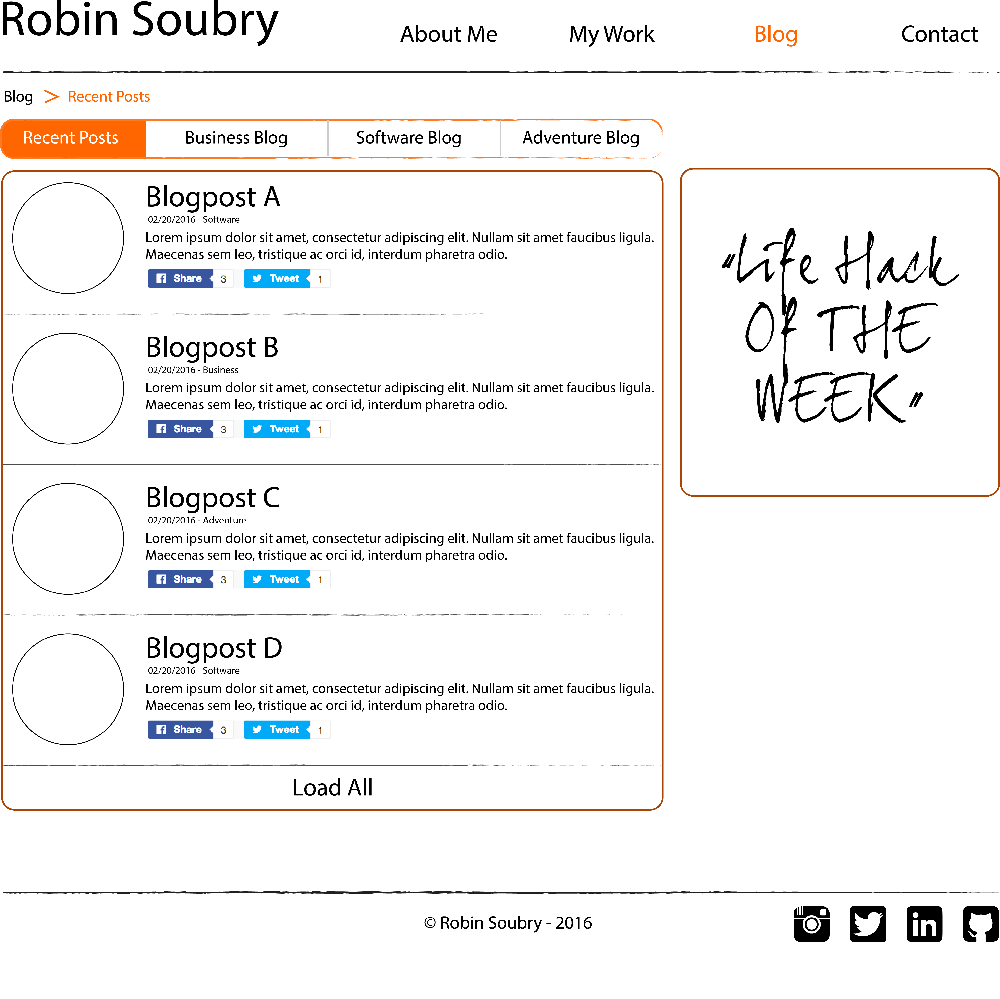

##General Website Index##

##Blog Page Index##

#Reflection#
##What is a wireframe?##
A wireframe is a sketch-like visual of a web interface. Large blocks of content, images etc are represented by outlined boxes, rudimentary text fields and some basic colors instead of a full-blown design. It's a technique that allows clear and efficient communication in the early stages of a project.

#What are the benefits of wireframing?#
* It's very fast (just some simple blocks of code)
* It does not contain too much detail, so the discussion (with coworkers or client) can be held about the structure of the site. Having too much details upfront may shift away the discussion to colors, image use, fonts, typo's etc that are less relevant at this stage of the design.
* Wireframes are should enable the designer to quickly validate the design, user flow etc. with real life customers: Is everything clear, did he/she miss out on an important element etc.

#Did you enjoy wireframing your site?#
Yes, I really like to wireframe, it makes an idea much more tangible. It is however a very dangerous topic to get trapped in rabbit-holes

#Did you revise your wireframe or stick with your first idea?#
I did not really have an idea upfront, so I just started from the site-map I had in mind and tried to figure out a compostition that would work well for all intended users in my "audience".

#What questions did you ask during this challenge? What resources did you find to help you answer them?#
Would my creation be clear to other users? Does it make sense to have three types of blog-content on one single site, and won't users be too confused?
I read quite a bit on UX design and best practices, but it often remains very high-level material with little concrete guidelines / checklists that are immediately of use. Have looked for some case studies, but following books caught my attention for further reading:
* __Don't Make Me Think__, by Steve Krug
* __Lean UX: Applying Lean Principles to Improve User Experience__, by Jeff Gothelf

#Which parts of the challenge did you enjoy and which parts did you find tedious?#
I enjoyed experimenting with different mock-up designs.
I disliked using Balsamiq. It's a fun and easy to understand tool with many drag & drop elements, but I would like to look for a tool that will also go beyond the plain mock-ups by helping to make detailed mockups and designs that will be implemented. Because Balsamiq is only working on the early stages, I feel that I will be required to start the whole design from scratch in another tool.
I will check OmniGraffle and Envision as alternative tools, but would be interested to know if there is a school standard around.