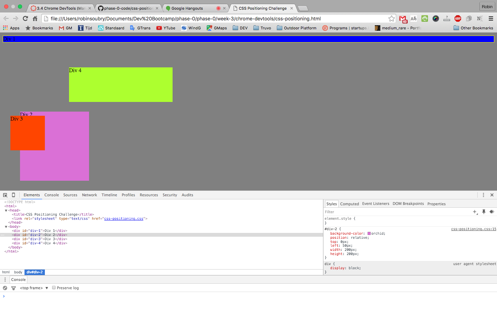
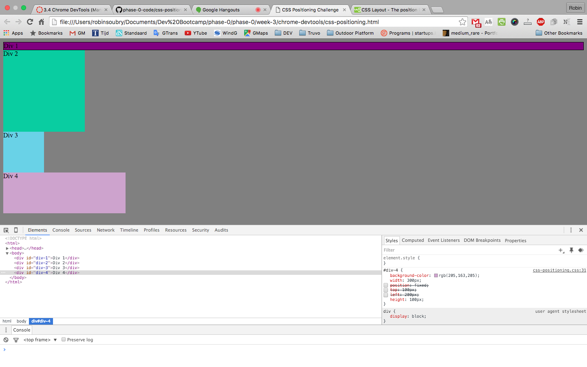
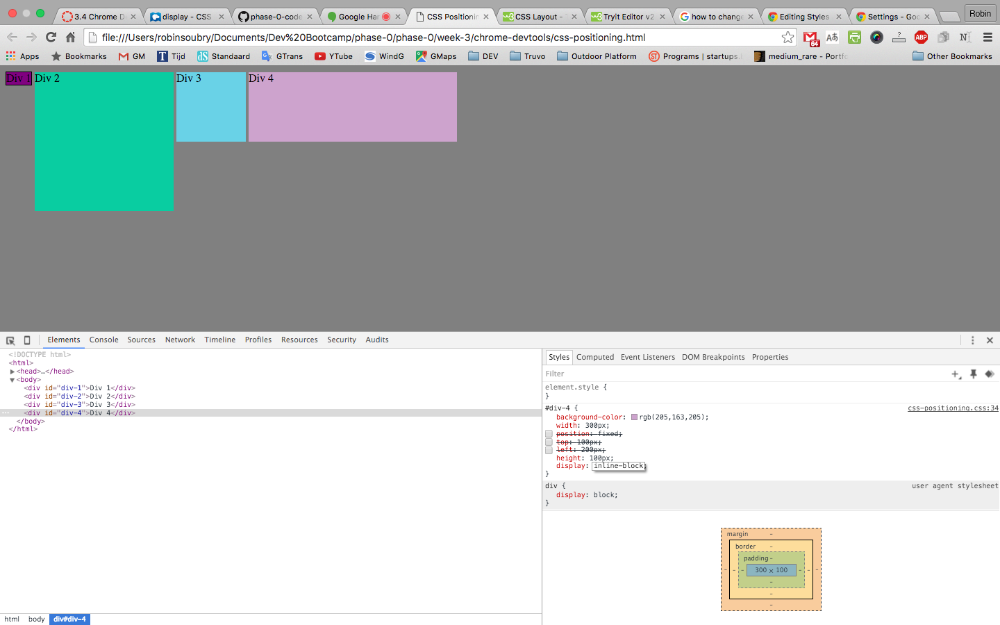
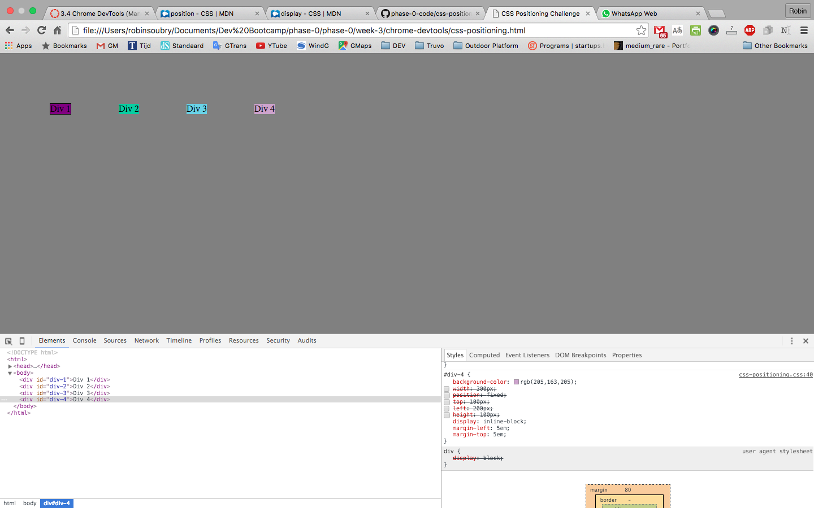
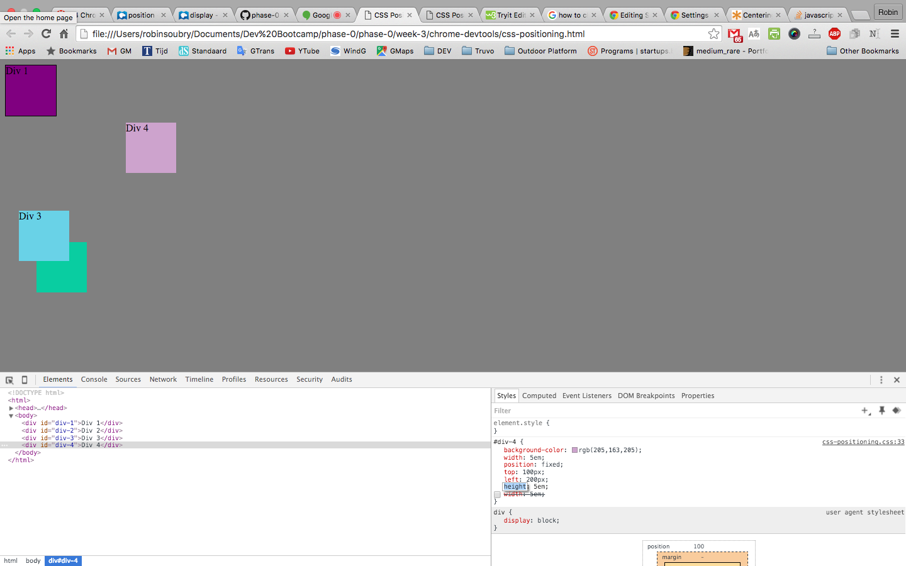
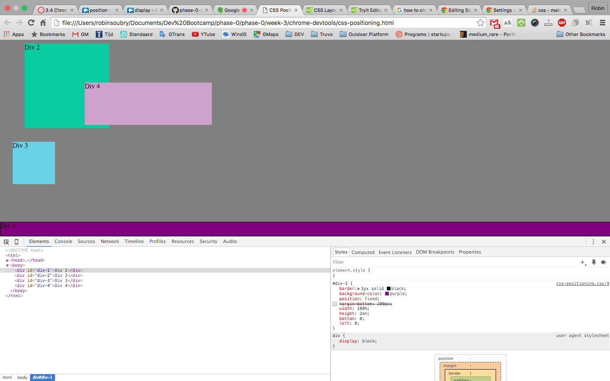
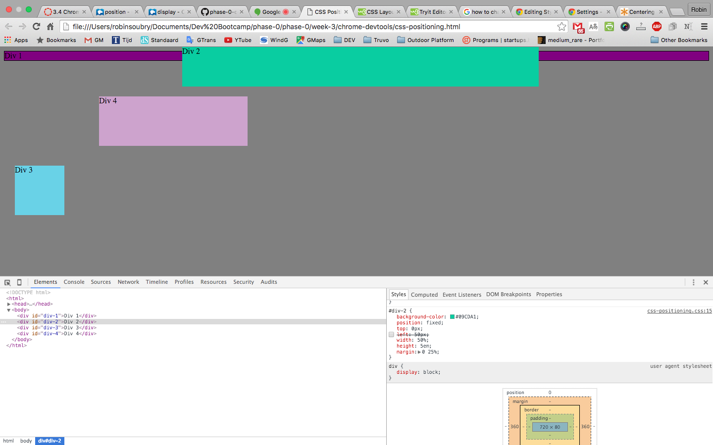
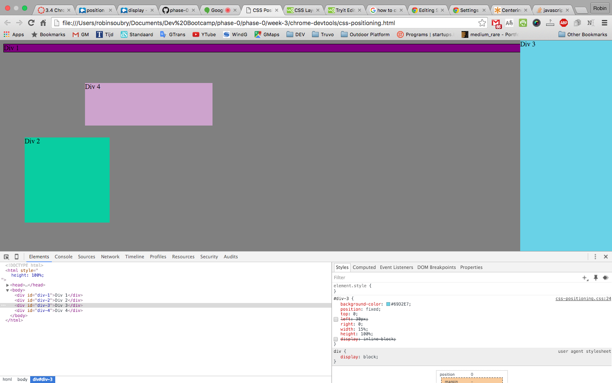
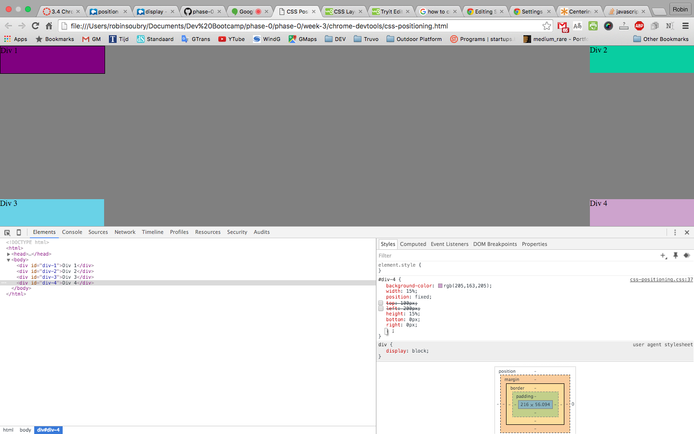

##How can you use Chrome's DevTools inspector to help you format or position elements?##

The Chrome DevTools allow the designer of a page to experiment with the CSS code without having to touch the actual code. This is helpful and safe because it eliminates the possibilty of overwriting correct code with mistakes.

##How can you resize elements on the DOM using CSS?##
Elements can be resized in various ways in CSS:
__Relative:__
	- You can express the size of an element as a _percentage_ of the div that hold the actual element.
	- You can express the size in _em values_. em 1 is the default size of the user's web browser, 1.5 em will render that element at 150% the normal size
__Absolute:__
	- Absolute sizes are defined by actual _pixels_ on a screen.

##What are the differences between absolute, fixed, static, and relative positioning? Which did you find easiest to use? Which was most difficult?##
__Absolute:__ Exact placement with respect to the web browser.
​
__Fixed:__ Exact placement in a set location. When scrolling the object will remain in the same place regardless of what section of the page is being viewed.
​
__Static:__ Object is in a set place and scrolls with all other objects on the page.
​
__Relative:__ Placement is relative to the place where it is supposed to be.

##What are the differences between margin, border, and padding?##
__Margin:__ is external to the div/element itself and transparent.
__Border:__ is the actual edge of the div/element.
__Padding:__ is space inside of the border of the div/element. Content will not overlap with the padding inside of a div/element.

##What was your impression of this challenge overall? (love, hate, and why?)##
The challenge is a great way of reinforcing the knowledge of certain CSS content and definitely illustrates how powerful this tool is to experiment with designs.

The trial and error process however was time consuming and a bit frustrating. Some of the tasks were very simple to complete, but through the trial and error process became much more difficult than need be.

####Change Colors####

####Column####

####Row####

####Make Equidistant####

####Squares####

####Footer####

####Header####

####Sidebar####

####Get Creative####
