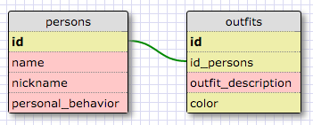

#Release 5: SELECTing data from a database#
##1. Select all data for all states.##
	SELECT * FROM states;

##2. Select all data for all regions.##
	SELECT * FROM regions;

##3. Select the state_name and population for all states.##
	SELECT state_name, population FROM states;

##4. Select the state_name and population for all states ordered by population. The state with the highest population should be at the top.##
	SELECT state_name, population FROM states ORDER BY population DESC;

##5. Select the state_name for the states in region 7.##
	SELECT state_name FROM states WHERE region_id = 7;

##6. Select the state_name and population_density for states with a population density over 50 ordered from least to most dense.##
	SELECT state_name, population FROM states WHERE population_density > 50 ORDER BY population_density ASC;

##7. Select the state_name for states with a population between 1 million and 1.5 million people.##
	SELECT state_name FROM states WHERE population BETWEEN 1000000 AND 1500000;

##8. Select the state_name and region_id for states ordered by region in ascending order.##
	SELECT state_name, region_id FROM states ORDER BY region_id ASC;

##9. Select the region_name for the regions with "Central" in the name.##
	SELECT region_name FROM regions WHERE region_name LIKE '%Central%';

##10. Select the region_name and the state_name for all states and regions in ascending order by region_id. Refer to the region by name. (This will involve joining the tables).##
	SELECT region_name, state_name FROM states JOIN regions ON states.region_id = regions.id ORDER BY region_id ASC;

****

#Release 6: Your Own Schema#

****

#Release 7: Reflect#
##What are databases for?##
Databases store data in a structured way, so that it can be easily searched and accessed in the future.

##What is a one-to-many relationship?##
A one-to-many relationship is a cardinality type.
In databases, each entity must be unique: In the outfit example ONE person may have MANY outfits. This doesn't mean that we want to duplicate the other non-outfit related information for each outfit this perosn has. In databases (as in other programming languages), we want to be DRY and avoid repetition at all costs! If for example you need to change the nickname of a person, you won't be required to update it for every line in the database.

##What is a primary key? What is a foreign key? How can you determine which is which?##
* A __primary key (PK)__ is a unique identifier for a record in a database. Every instance must have a primary key and this key must be unique for all the rows in that table.
* A __foreign key (FK)__ is a column in another table that refers to the primary key of another entity.
* You can distinguish PKs from FKs because they have to be unique. FKs don't have this requirement (you can have repetition of a value in the FK column)

##How can you select information out of a SQL database? What are some general guidelines for that?##
* You open the statement with SELECT and define which columns you want to return.
* You define which table you want to select from with the keyword FROM + table_name
* You apply conditional statements, ordering logic etc.
* You close the statement with a semi-colon ;