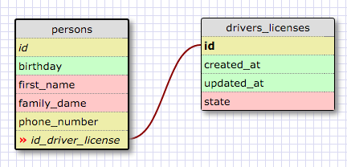
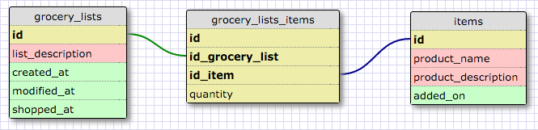

#Challenges#
##Release 2: One-to-one relationships##

One-to-one relationships are actually pairs that are directly connected.
A can have a driver's license, but only 1… And one driver's license can't have multiple owners.
For most one-to-one relationships, you may technically add the data in one single table, but sometimes it's considered to be helpful when you want to keep track of separate drivers-license information…
This case often makes sense in privacy sensitive databases, where criminal records, medical data, tax information etc all belong to the same person, but need to be stored separately.

##Release 4: Refactor##

#Reflection#
##What is a one-to-one database?##
A one-to-one database contains information about the exact same entry.

##When would you use a one-to-one database? (Think generally, not in terms of the example you created).##
You may want to create a separate table for some data-fields about the entry to:
	* keep the database better organized and make logical groups of data
	* enforce access-permissions and implement data-protection barriers for sensitive data. For example financial data for public companies will have different levels of access… A junior analyst may access weekly sales performance but may be restricted from access to debt or M&A data.

##What is a many-to-many database?##
A many-to-many relationship exists when elements from one table can mix and match with elements from another table. For example, a person can own one or more cars and one care can be driven by one or more persons (ie. a family car)

##When would you use a many-to-many database? (Think generally, not in terms of the example you created).##
A many-to-many relationship should be established in all cases where there can and element from table A can (but does not have to) have multiple connections to an element of table B AND an element of table B can (but does not have to) have multiple connections to an element of table A.

##What is confusing about database schemas? What makes sense?##
The theory makes a lot of sense and is pretty straightforward. On the other hand, I believe the schema-designer tool to be an absolute pain. When I look at database schemes online for example they all have symbols (ie. a line that splits into three lines to indicate an "to-many" relationship)… The schema-designer however just gives a color which is not explicit in any way…
A tool like MySQL Workbench would be more helpful to create and design database-schemas.